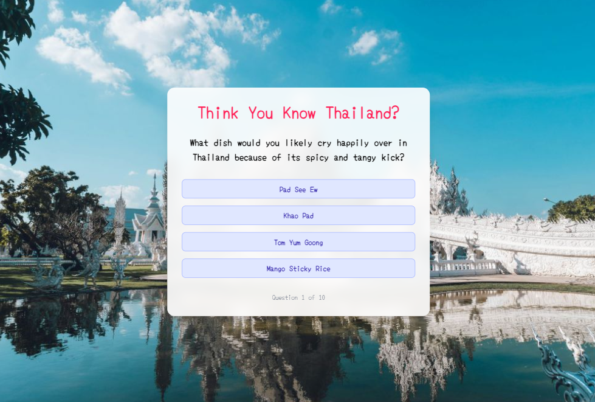

# Think You Know Thailand? - Quiz App

An interactive and playful quiz app built with **React**, **Vite**, and **Tailwind CSS** that tests your knowledge about Thailand! This project is a blend of creativity, coding and cultural fun — complete with colorful UI, smooth transitions, real-time feedback and personalized results based on your score.

---

## 🧠 Why This Project?

I created this app as a hands-on way to strengthen my **React** and **Tailwind CSS** skills. Instead of sticking to tutorials, I chose to learn by building something meaningful, interactive, and infused with my personality and cultural inspiration.

> This project helped me understand how to manage dynamic state, animations, conditional rendering, and responsive design — all while having fun creating a quirky, culturally flavored app!

---

## ✨ Features

- 🎯 10 creative quiz questions about Thailand
- 🎉 Score feedback with humorous results
- 🌈 Random background images with smooth fade transition
- ✅ Real-time feedback on each answer (Correct / Oops!)
- 🔁 Restartable quiz session
- 📱 Mobile responsive and centered layout on all screens
- ⚡ Built with Vite for fast dev/build performance

---

## 🛠️ Tech Stack

- **React** – component-based UI
- **Vite** – fast build tool
- **Tailwind CSS** – utility-first styling
- **JavaScript (ES6+)**

---

## 🙌 Credits

Background images from [Unsplash](https://unsplash.com/) and quiz content are used for educational purposes and creative fun. If you love Thailand or just want to learn more, enjoy the quiz!

---

## 📚 What I Learned

- Mastered state handling and UI updates in React

- Smooth animations with Tailwind transitions

- Structuring a complete SPA with feedback and scoring logic

- Random image handling and transitions

- Building and deploying a full project with modern tools

---

## 📬 Feedback & Contributions

If you have ideas, suggestions, or just enjoyed the quiz — feel free to open an issue or fork the repo and make it your own!

---

## 🔗 License
This project is open-source and free to use under the MIT License.

---

Let me know if you’d like a deploy script, help adding a screenshot, or automating deployment with GitHub Actions!
